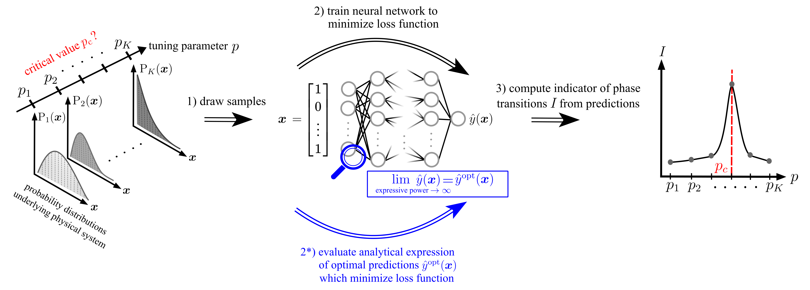

# Replacing neural networks by optimal analytical predictors for the detection of phase transitions
This repository contains a Julia implementation for the approach introduced in our
[paper](https://arxiv.org/abs/xxxx).

### Abstract of the paper
Identifying phase transitions and classifying phases of matter is central to understanding the properties and behavior of a broad range of material systems. In recent years, machine-learning (ML) techniques have been successfully applied to perform such tasks in a data-driven manner. However, the success of this approach notwithstanding, we still lack a clear understanding of ML methods for detecting phase transitions, particularly of those that utilize neural networks (NNs). In this work, we derive analytical expressions for the optimal output of three widely used NN-based methods for detecting phase transitions. These optimal predictions correspond to the output obtained in the limit of perfectly trained and sufficiently large NNs. The inner workings of the considered methods are revealed through the explicit dependence of the optimal output on the input data. By evaluating the analytical expressions, we can identify phase transitions from data without training NNs. Our theoretical results are supported by extensive numerical simulations covering, e.g., topological, quantum, and many-body localization phase transitions. We expect similar analyses to provide a deeper understanding of other classification tasks in condensed-matter physics.



### This repository

contains code to identify phase transitions from data using supervised learning, learning by confusion, or the prediction-based method, using the optimal analytical expressions or neural networks. We provide exemplary code for

* the symmetry-breaking phase transition in the two-dimensional square lattice ferromagnetic Ising model (of size $L=10$ and $L=60$), see [the file](./continuously-updated-control/Control.jl),

* and the many-body localization phase transition in the Bose-Hubbard chain, see [the file](./piecewise-constant-control/Control.jl).

Other physical systems can be analyzed in the same fashion by encoding the corresponding probability distributions.

### How to run / prerequisites:

- install [julia](https://julialang.org/downloads/)
- individual files can be executed by calling, e.g., `julia ising_opt.jl`
- output data/figures are stored in the associated data/figures folder.

## Authors:

- [Julian Arnold](https://github.com/arnoldjulian)
- [Frank Schäfer](https://github.com/frankschae)

```
@article{arnold:2022,
  title={Replacing neural networks by optimal analytical predictors for the detection of phase transitions},
  author={Arnold, Julian and Sch\"{a}fer, Frank},
  journal={arXiv preprint arXiv:xxx},
  year={2022}
}
```
